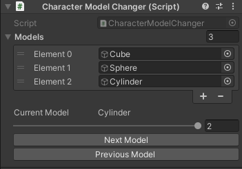

# MinMaxSlider

Made by OlympianGames - [Link](https://github.com/OlympianGames/UnityResources/tree/main/UnityScripts)

## About

Simple script that allows for the easy switch of character model by activating one, and deactiviating the rest. Can be used for other things beside changing a characters model, thats just the reason it was made.

## Images

