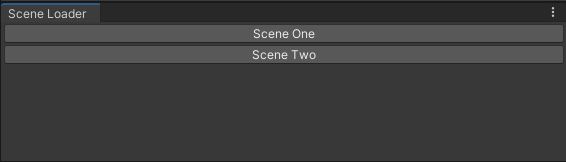

# Inspector Helper

Made by OlympianGames - [Link](https://github.com/OlympianGames/UnityResources/tree/main/UnityScripts)

## About

Scripts that adds a editor window for switching between game scenes faster

## Gettings Started

1) Import the scripts
2) Create a EditorSceneAsset scriptable object
3) Adds all the scenes to the list on the scriptable object
4) Set the scene names on the scriptable object
5) Get the scene asset from the menu item "Tools/Scene Loader/Get Scene Asset"

## Images

