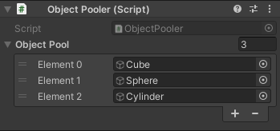

# Object Creator

Made by OlympianGames - [Link](https://github.com/OlympianGames/UnityResources/tree/main/UnityScripts)

## About

Custom object creation manager that helps for making/getting objects. Includes a different way to insantiate objects, and a object pooler currently. Probably not the best way to do it, as this is more of a test.

## Example

``` C#
  // For insantiating a new object
  ObjectCreator.Instantiate(prefab, position, rotation, parent);

  // For retrieving an object from a pool
  ObjectPooler.RequestObject(pool, position, rotation, parent);

  // For retrieving an object directly from the pool
  pool.RetrieveObject(position, rotation, parent);

```

## Images
#### Object Pool Inspector View


