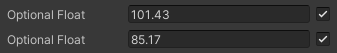

# Optional

Made by INeatFreak - [Link](https://gist.github.com/INeatFreak/e01763f844336792ebe07c1cd1b6d018)


## About

2 scripts that add a unity attribute that allows for option bools, integers, floats, and transforms.

## Example

``` C#
    public Optional<float> optionalFloat = 100.95f;
```


## Images



